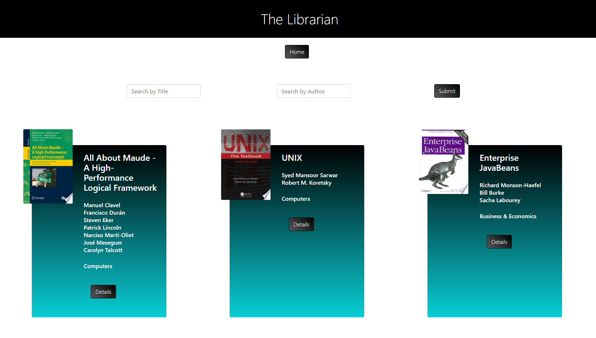
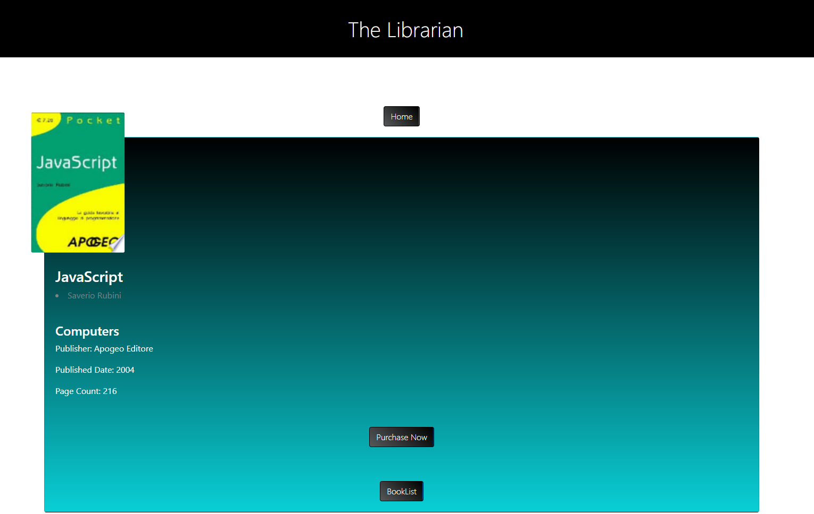

# React-Project-Felice-Bocchini 

With this app you can search for books and get any information about each one.
You can search for books by its name or the author's name

You can see the description of the book. Clicking on the cover shows the preview and various information, instead by clicking on the "purchase now" button, you will be given the opportunity to purchase the e-book.

# Built with
* HTML
* CSS
* Javascript
* React.js
* Bootstrap
* Google Books API
* Firebase

# Contacts
* Felice Bocchini - [Instagram](https://www.instagram.com/felixkou07/)
* felice.bocchini@gmail.com